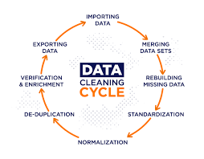

# FCB-DTA_Project-1
## Documentation
I started a bootcamp training organised by incubator nigeria and at the end of this training i am very sure i will be able to analyse and visualise data using PowerBI tool

## Github accout creation
I created an github account to save my works, allow collaboration on my profile 
---
## Tools used
- Ms Excel
- Microsoft Power BI
- SQL
- PHYTHON
---
## Link needed
Microsoft Excel *for* **Data Cleaning** [Download here](https://kaggle.com)

~~~

Google Query Sheet

SELECT * FROM TABLE 1
WHERE CONDITION = MET

~~~

|Heading 1 | Heading 2 | Heading 3|
| ---------| ----------| ---------|
|Data 1 | Data 2 | Data 3|
|Data 4 | Data 5 | Data 6|
